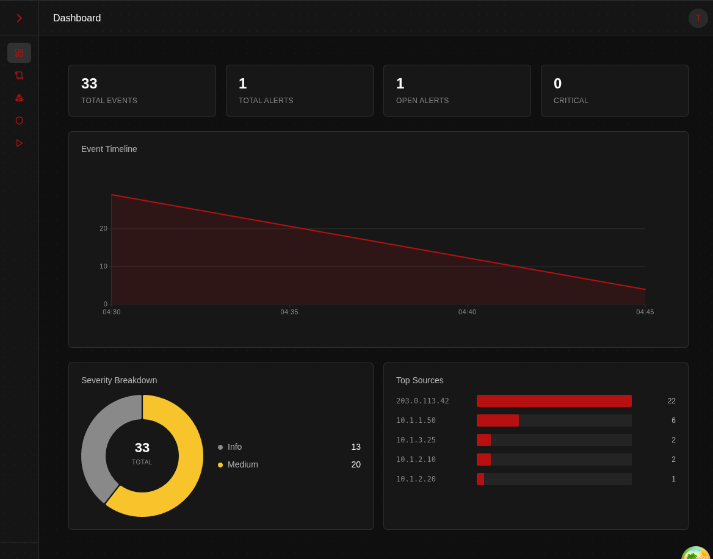
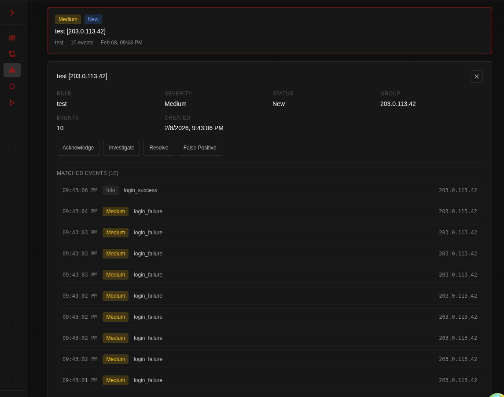
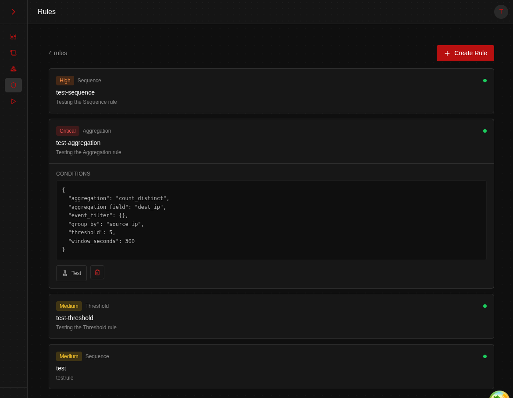
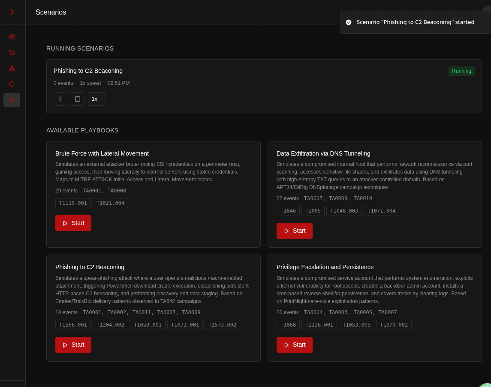
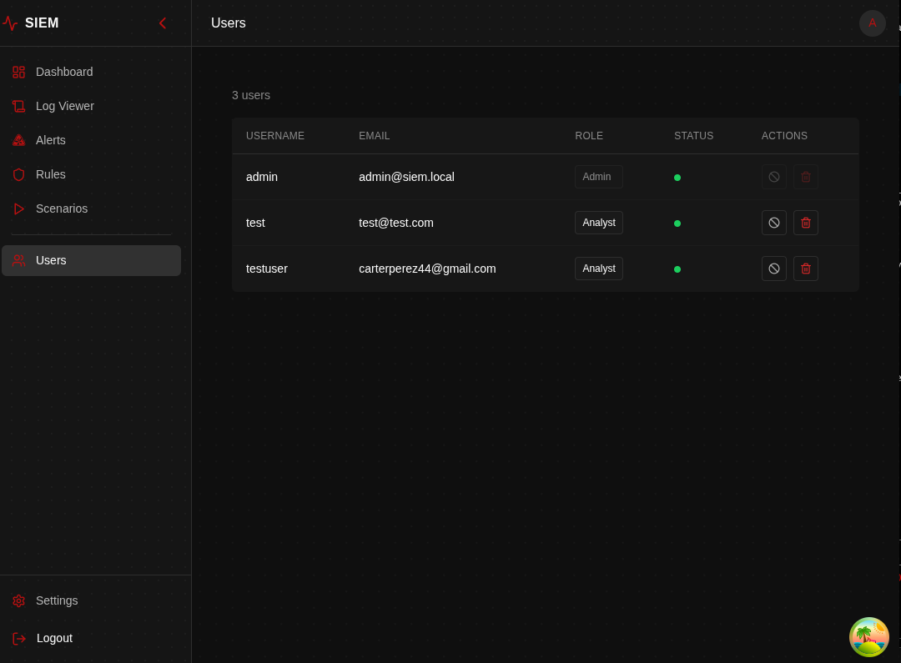

<!-- DEMO.md -->

<div align="center">

```ruby
███████╗██╗███████╗███╗   ███╗
██╔════╝██║██╔════╝████╗ ████║
███████╗██║█████╗  ██╔████╔██║
╚════██║██║██╔══╝  ██║╚██╔╝██║
███████║██║███████╗██║ ╚═╝ ██║
╚══════╝╚═╝╚══════╝╚═╝     ╚═╝
```

**Demo & Preview**

<br>

```ruby
docker compose up -d    →    localhost:8431
```

<br>

[Dashboard](#dashboard) · [Log Viewer](#log-viewer) · [Alert Investigation](#alert-investigation) · [Correlation Rules](#correlation-rules) · [Attack Scenarios](#attack-scenarios) · [User Management](#user-management)

</div>

---

### Dashboard

Real-time event counters, severity breakdown by donut chart, event timeline, and top source IP ranking


---

### Log Viewer

Paginated event stream filterable by source, severity, and event type with timestamp correlation



---

### Alert Investigation

Correlated alert drill-down with matched event timeline and lifecycle controls — Acknowledge, Investigate, Resolve, False Positive



---

### Correlation Rules

Threshold, Sequence, and Aggregation rule types with inline JSON condition editing and severity classification



---

### Attack Scenarios

Four MITRE ATT&CK mapped playbooks generating realistic multi-stage events — brute force with lateral movement, DNS tunneling exfiltration, phishing to C2 beaconing, privilege escalation with persistence



---

### User Management

Role-based access control with Admin and Analyst roles, account provisioning, and status management


